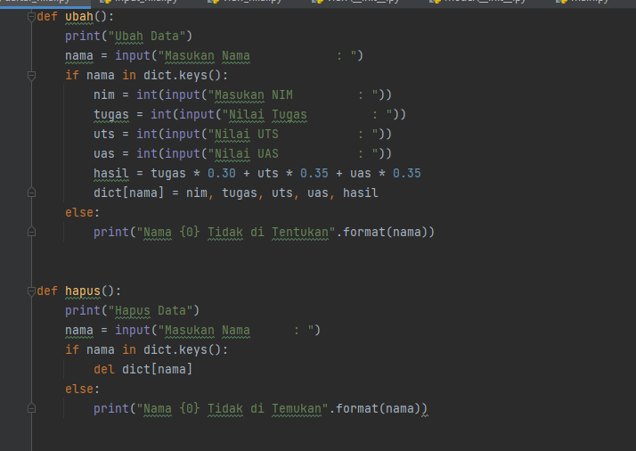
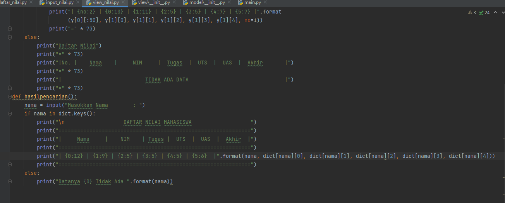
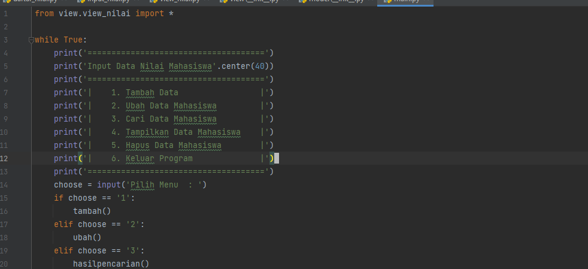
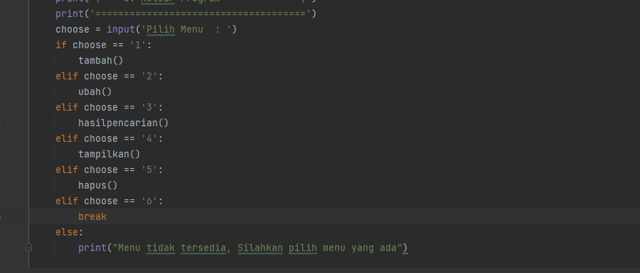

# HasilUas
## Membuat Package dan Modul dengan struktur seperti yang di Tentukan Soal
#### Nama : Ravansa Rahman
#### NIM : 312110103
#### Kelas : TI.21.A2
#### MatKul : Bahasa Pemrograman

### Penjelasan Program
Ini adalah Program Penginputan data Mahasiswa dengan Package dan Modul
Berikut Gambar Dari Struktur Program

✓ daftar_nilai.py berisi modul untuk:
tambah_data, ubah_data, hapus_data, dan cari_data

✓ view_nilai.py berisi modul untuk:
cetak_daftar_nilai, cetak_hasil_pencarian

✓ input_nilai.py berisi modul untuk:
input_data yang meminta penggunamemasukkan data.

✓ main.py berisi program utama (menu pilihan yang memanggil semua menu yang ada)

Menjalankan file Main karna dia adalah file utama untuk memanggil fungsi-fungsi yang ada lalu akan muncul menu seperti berikut:

Kita sebagai user di perkenankan untuk memilih fungsi program dengan ketentuan:
input no 1. Untuk Tambah Data (Ketika Memilih 1 data dari input nilai dan daftar nilai di tarik ke main untuk di beri data)
input no 2. Untuk Ubah Data Mahasiswa (Ketika Memilih 2 Data dari Dictionary di cari dan di ubah melewati input )
input no 3. Untuk Cari Data Mahasiswa (Ketika Memilih 3 Data dari Dictionary di cari dan di tampilkan sesuai nama yang di input)
input no 4. Untuk Tampilkan Data Mahasiswa (Ketika Memilih 4 Data Mahasiswa dari Dictionary di tampilkan semua yang ada)
input no 5. Untuk Hapus Data Mahasiswa (Ketika memilih 5 Data yang di input akan di hapus apabila sesuai dengan nama yang ada)
input no 6. Untuk Keluar Program (Ketika memilih 6 Program akan berakhir)
### Contoh Cara Kerja Program:
Jika kita memilih no 1, disini kita di harus kan menginput data yang berupa Nama, Nim, NilaiTugas, NilaiUts, NilaiUas

Menggunakan Fungsi 3 Untuk mencari data seorang mahasiswa dengan memasukan Nama nya

Menggunakan Fungsi 4 untuk melihat semua data mahasiswa yang ada

Menggunakan Fungsi 2 Untuk Mengubah Data Mahasiswa dengan cara manginput namanya

Seperti yang terlihat hanya data dengan nama riri yang terganti

Menggunakan Fungsi 5 untuk menghapus data mahasiswa dengan menginput namanya

Seperti yang terlihat data ravansa telah terhapus dari daftar nilai

Menggunakan Fungsi 6 untuk keluar dari program

### Codingan Program

## Sekian Dan Terimakasih